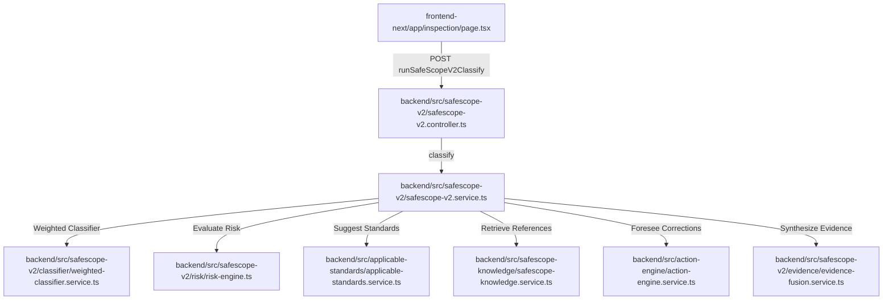

# SafeScope AI Evaluation & Improvement Blueprint

This document defines the comprehensive architecture, evaluation criteria, and concrete code blueprints to upgrade the **SafeScope Safety Intelligence Engine** of Sentinel Safety. This blueprint addresses the limitations in the current keyword-centric matching models and provides a transition plan to a family-gated, defensible safety-reasoning architecture.

---

## 1. SafeScope Current Logic & File Audits

The SafeScope intelligence suite spans both the `frontend-next` client and the `backend` services. The core architectural layers are distributed across these primary modules:



### A. Hazard Classification
*   **Weighted Classification Service:** Located in [weighted-classifier.service.ts](file:///Users/mckinley/Sentinel_Safety/backend/src/safescope-v2/classifier/weighted-classifier.service.ts), this class compares the input narrative against the pre-compiled `HAZARD_TAXONOMY` database.
*   **Taxonomy Configuration:** Located in [hazard-taxonomy.ts](file:///Users/mckinley/Sentinel_Safety/backend/src/safescope-v2/taxonomy/hazard-taxonomy.ts), this file assigns weight-based points to input tokens (e.g. `strongSignals`, `moderateSignals`, `weakSignals`, `negativeSignals`).
*   **Deterministic Fallback:** A basic token fallback service resides in [deterministic-classifier.ts](file:///Users/mckinley/Sentinel_Safety/backend/src/safescope-v2/engine/deterministic-classifier.ts).

### B. Standard Matching
*   **Direct Hardcoded Mappings:** Located in [standards-mapping.seed.ts](file:///Users/mckinley/Sentinel_Safety/backend/src/safescope-v2/standards-mapping.seed.ts), this file maps standard categories (e.g. `Electrical`, `Machine Guarding`) to explicit MSHA and OSHA CFR regulations via a curated static dictionary.
*   **Dynamic Database Search:** Located in [applicable-standards.service.ts](file:///Users/mckinley/Sentinel_Safety/backend/src/applicable-standards/applicable-standards.service.ts), this service queries the database `standards_master` table using the `suggest` method, which utilizes simple keyword scanning to dynamically rank candidate regulations.

### C. Risk Scoring
*   **Core Risk Engine:** Located in [risk-engine.ts](file:///Users/mckinley/Sentinel_Safety/backend/src/safescope-v2/risk/risk-engine.ts), this file scores observed hazards based on severity weight and likelihood mapping matrices.

### D. Corrective Action Generation
*   **Action Engine Service:** Located in [action-engine.service.ts](file:///Users/mckinley/Sentinel_Safety/backend/src/action-engine/action-engine.service.ts), this module maps recommended safety controls and creates pre-configured corrective actions.

### E. Frontend Display of SafeScope Output
*   **Inspection Page:** Located in [page.tsx](file:///Users/mckinley/Sentinel_Safety/frontend-next/app/inspection/page.tsx), this handles workflow steps and builds findings via `buildFinding()`.
*   **Primary Decision Section:** Located in [SafeScopePrimaryDecisionSection.tsx](file:///Users/mckinley/Sentinel_Safety/frontend-next/components/inspection/SafeScopePrimaryDecisionSection.tsx), this displays the core summary card containing classification, risk band, primary standard, and verification check items.
*   **Detailed Reasoning Panels:** Splitting complex analytics into collapsible modules:
    *   [SafeScopeReasoningPanel.tsx](file:///Users/mckinley/Sentinel_Safety/frontend-next/components/inspection/SafeScopeReasoningPanel.tsx)
    *   [SafeScopeKnowledgeBrainSection.tsx](file:///Users/mckinley/Sentinel_Safety/frontend-next/components/inspection/SafeScopeKnowledgeBrainSection.tsx)
    *   [SafeScopeStandardsSection.tsx](file:///Users/mckinley/Sentinel_Safety/frontend-next/components/inspection/SafeScopeStandardsSection.tsx)
    *   [SafeScopeSupportingIntelligenceSection.tsx](file:///Users/mckinley/Sentinel_Safety/frontend-next/components/inspection/SafeScopeSupportingIntelligenceSection.tsx)
    *   [CorrectiveActionsSection.tsx](file:///Users/mckinley/Sentinel_Safety/frontend-next/components/inspection/CorrectiveActionsSection.tsx)

---

## 2. Analysis of Current Weaknesses & Failures

The known failure—where inputting `"missing fire extinguisher in haul truck"` returned a Machine Guarding regulation (`30 CFR 56.14107(a)`) instead of a Fire Protection or Mobile Equipment standard—exposes four systemic design flaws:

### A. Lack of Category-Family Gating in the Dynamic Query Engine
In [applicable-standards.service.ts](file:///Users/mckinley/Sentinel_Safety/backend/src/applicable-standards/applicable-standards.service.ts), the `suggest()` search method queries up to 5,000 active regulations from the `standards_master` database. It scores them inside a mapping loop without checking if the regulation's target hazard family (e.g. `"Machine Guarding"`) is compatible with the classified category. If the classifier yields `Powered Mobile Equipment`, the query engine still scores and suggests `Machine Guarding` regulations if keywords overlap.

### B. Over-reliance on Generic Keyword Matching
The `applicable-standards.service.ts` scores candidates by checking if the observed text contains words in the standard's `keywords` list or `title` words:
```typescript
for (const keyword of keywords) {
  if (observation.includes(keyword.toLowerCase())) {
    score += 12;
  }
}
```
If a machine guarding standard has general keywords like `"machine"`, `"equipment"`, or `"drive"`, any observation containing these words receives an immediate score boost.

### C. The "Machine/Equipment" Semantic Collapses
The word `"truck"` contains `"equipment"` and `"machine"` indicators in common safety glossaries, and `"haul truck"` is mobile machinery. Because `Machine Guarding` standards score heavily on `"machine"` and `"equipment"`, their score dynamically inflates.

### D. Missing Negative Penalty Weighting for Family Mismatches
There is no penalty layer in `applicable-standards.service.ts` that detects when an MSHA/OSHA citation belongs to a family that is completely disjoint from the classified hazard family. A `Fire Protection` hazard should heavily penalize any `Machine Guarding` or `Fall Protection` standards to keep them out of the suggestion array.

---

## 3. The SafeScope Evaluation Gauntlet Framework

To guarantee SafeScope behaves as a true safety expert, we propose establishing a strict regression and validation framework: the **SafeScope Gauntlet**.

### A. Test Scenario Fields (JSON & TypeScript Schema)
Every test scenario within the gauntlet must possess these fields:

| Field | Type | Description |
| :--- | :--- | :--- |
| `scenarioId` | `string` | Unique identifier (e.g., `GAUNTLET-001`) |
| `sourceType` | `string` | Origin of testing source (e.g., `field_observation`, `hard_negative`) |
| `agency` | `"MSHA" \| "OSHA"` | Target federal agency |
| `industryContext` | `string` | Specific industry context (e.g., `surface_mining`, `construction`) |
| `observation` | `string` | The raw text input entered by the inspector |
| `equipmentContext` | `string` | Specific machinery involved |
| `primaryHazardFamily` | `string` | Expected primary hazard category |
| `secondaryHazardFamilies` | `string[]` | Overlapping secondary families |
| `expectedStandardFamily` | `string` | Target family of the returned regulation |
| `unacceptableStandardFamilies`| `string[]` | Families that **must never** be suggested (e.g. `Machine Guarding` for fire items) |
| `expectedCorrectiveActionTheme`| `string` | The expected theme of the corrective action (e.g. `provide_extinguisher`) |
| `severityExpectation` | `string` | Expected risk level (`low`, `medium`, `high`, `critical`) |
| `reasoningExpectation` | `string` | Explanatory statement justifying the classification |

### B. Evaluation Scoring Rubric (Total: 100 Points)

1.  **Primary Hazard Family Match (30 Points):**  
    Full points if the engine's primary classification matches the `primaryHazardFamily`. 0 points if completely disjoint.
2.  **Context Recognition (15 Points):**  
    Awarded if key machinery, location context, or environmental factors are correctly mapped into the `expandedContext` metadata.
3.  **Standard Family Match (25 Points):**  
    Full points if the primary suggested regulation falls within the `expectedStandardFamily` scope.
4.  **Absence of Unacceptable Matches (15 Points):**  
    **Critical Deductions:** -30 points if any regulation in `unacceptableStandardFamilies` appears in the top 3 suggestions (failing the test immediately).
5.  **Corrective Action Relevance (10 Points):**  
    Full points if at least one generated action matches the `expectedCorrectiveActionTheme`.
6.  **Confidence Calibration (5 Points):**  
    Full points if the `confidenceBand` matches the ambiguity level (e.g., highly ambiguous inputs must yield `low` confidence).

---

## 4. Initial Seed Gauntlet (100 Scenarios)

The initial seed gauntlet is fully compiled and stored in the project root:
👉 **[safescope-gauntlet.seed.json](file:///Users/mckinley/Sentinel_Safety/safescope-gauntlet.seed.json)**

It contains **100 realistic test scenarios** spanning MSHA Surface/Underground Mining, OSHA General Industry (1910), and OSHA Construction (1926) scopes. 

### Highlighted Test Case: GAUNTLET-001 (The Fire Extinguisher Failure)
```json
{
  "scenarioId": "GAUNTLET-001",
  "sourceType": "field_observation",
  "agency": "MSHA",
  "industryContext": "surface_mining",
  "observation": "missing fire extinguisher in haul truck",
  "equipmentContext": "cat_777_haul_truck",
  "primaryHazardFamily": "Fire Protection",
  "secondaryHazardFamilies": ["Powered Mobile Equipment"],
  "expectedStandardFamily": "Fire / Explosion",
  "unacceptableStandardFamilies": ["Machine Guarding", "Machine"],
  "expectedCorrectiveActionTheme": "provide_fire_extinguisher",
  "severityExpectation": "high",
  "reasoningExpectation": "Fire extinguisher required on self-propelled mobile equipment under 30 CFR 56.4100 or 56.9100. Machine guarding is completely irrelevant."
}
```

---

## 5. Improved SafeScope Matching Architecture

To prevent semantic collapses and keyword mis-matching, the core engine must be restructured into a modular pipe:

```
[Inspector Narrative]
       │
       ▼
┌──────────────────────────────────────────────┐
│  1. Primary Hazard-Family Classifier         │ ──► Mapped to exact Hazard Family
└──────────────────────────────────────────────┘
       │
       ▼
┌──────────────────────────────────────────────┐
│  2. Context Extractor & Agency Resolver      │ ──► Identifies MSHA vs OSHA & equipment
└──────────────────────────────────────────────┘
       │
       ▼
┌──────────────────────────────────────────────┐
│  3. Standards Family Gate                    │ ──► Limits candidates to target family
└──────────────────────────────────────────────┘
       │
       ▼
┌──────────────────────────────────────────────┐
│  4. Exclusion / Negative Penalty Layer       │ ──► Applies heavy penalties for mismatches
└──────────────────────────────────────────────┘
       │
       ▼
┌──────────────────────────────────────────────┐
│  5. Standards Reranker & Action Mapper       │ ──► Ranks standards & selects actions
└──────────────────────────────────────────────┘
       │
       ▼
[Defensible Safety Decision + Traceability]
```

1.  **Primary Hazard-Family Classifier:** Uses a multi-tiered classifier (first resolving semantic safety families like `Electrical`, `Fire`, `Machine Guarding`, `PPE` before attempting sub-classification).
2.  **Context Extractor:** Parses equipment, actions, and states to understand specific danger profiles.
3.  **Agency/Scope Resolver:** Gathers metadata to filter MSHA vs. OSHA General vs. OSHA Construction.
4.  **Standards Family Gate:** Restricts standard searches by checking standard categories.
5.  **Exclusion/Penalty Layer:** Injects heavily negative weights if a standard contains keywords or families tagged as incompatible with the classified family.
6.  **Standard Reranker:** Combines keyword scores, semantic context boosts, and feedback adjustments.
7.  **Explanation Generator:** Writes a clear audit-ready statement justifying the match.
8.  **Regression Test Harness:** Automatically executes the 100-scenario Gauntlet on every build.
9.  **Human Feedback Loop:** Feeds accepted/rejected actions and standards back into workspace-specific adjustments.

---

## 6. Concrete Code Blueprints & Changes

### A. Target Files to Modify or Create
*   **Create:** `backend/src/safescope-v2/evaluation/gauntlet-evaluator.ts` (The testing and scoring runner).
*   **Modify:** `backend/src/applicable-standards/applicable-standards.service.ts` (Implement category gating and negative penalty layers).
*   **Modify:** `backend/src/safescope-v2/safescope-v2.service.ts` (Integrate the gated standard workflow).

### B. TypeScript Interfaces

```typescript
export interface GauntletScenario {
  scenarioId: string;
  sourceType: 'field_observation' | 'hard_negative' | 'incident_report';
  agency: 'MSHA' | 'OSHA';
  industryContext: string;
  observation: string;
  equipmentContext?: string;
  primaryHazardFamily: string;
  secondaryHazardFamilies?: string[];
  expectedStandardFamily: string;
  unacceptableStandardFamilies: string[];
  expectedCorrectiveActionTheme: string;
  severityExpectation: 'low' | 'medium' | 'high' | 'critical';
  reasoningExpectation: string;
}

export interface ScenarioEvalResult {
  scenarioId: string;
  passed: boolean;
  score: number;
  assignedCategory: string;
  topSuggestedCitations: string[];
  matchedActions: string[];
  confidenceScore: number;
  unacceptableCitationsFound: string[];
  deductions: number;
  reasoning: string;
}

export interface GauntletSuiteSummary {
  executedCount: number;
  passedCount: number;
  failedCount: number;
  successRate: number;
  averageScore: number;
  criticalFailuresCount: number;
  detailedResults: ScenarioEvalResult[];
}
```

### C. Implementation Pseudocode

#### 1. Hazard Family Gating & Penalty Calculation
Implement this helper within `ApplicableStandardsService` to restrict database results by matching the standard's metadata against the classified family.

```typescript
function calculateGatingScoreAdjustments(
  standardCitation: string,
  standardFamily: string,
  classifiedFamily: string,
  unacceptableFamilies: string[],
  observationText: string
): { penalty: number; matchesGate: boolean; reason: string } {
  
  // 1. Check for explicit unacceptable matches
  if (unacceptableFamilies.includes(standardFamily)) {
    return {
      penalty: -150, // Heavy disqualifying penalty
      matchesGate: false,
      reason: `Disqualified: Standard family ${standardFamily} is explicitly blocked for classified hazard ${classifiedFamily}`
    };
  }

  // 2. Family Gating Checks
  const normalizedObservation = observationText.toLowerCase();
  
  // Hard negative fire vs machine gating check
  if (classifiedFamily === 'Fire / Explosion' || classifiedFamily === 'Fire Protection') {
    if (standardFamily === 'Machine Guarding' || standardFamily === 'Machine') {
      return {
        penalty: -120,
        matchesGate: false,
        reason: 'Disqualified: Machine guarding standards are unacceptable for fire protection hazards.'
      };
    }
  }

  // Mobile Equipment exceptions
  if (classifiedFamily === 'Mobile Equipment / Traffic' || classifiedFamily === 'Powered Mobile Equipment') {
    const fireRelated = /(fire|extinguisher)/i.test(normalizedObservation);
    if (fireRelated && standardFamily === 'Fire / Explosion') {
      return {
        penalty: 40, // Positive boost for fire protection on vehicles
        matchesGate: true,
        reason: 'Boosted: Fire protection equipment identified on mobile machinery.'
      };
    }
  }

  return { penalty: 0, matchesGate: true, reason: 'Passed gating check' };
}
```

#### 2. Gauntlet Evaluation Runner
This service parses the JSON seed file, runs the classifer/suggest engines, scores results, and flags critical failures.

```typescript
import { Injectable } from '@nestjs/common';
import { SafescopeV2Service } from '../safescope-v2.service';
import { GauntletScenario, ScenarioEvalResult, GauntletSuiteSummary } from './interfaces';

@Injectable()
export class GauntletEvaluator {
  constructor(private readonly safescopeService: SafescopeV2Service) {}

  async evaluateScenario(scenario: GauntletScenario): Promise<ScenarioEvalResult> {
    const result = await this.safescopeService.classify(
      scenario.observation,
      scenario.agency === 'MSHA' ? ['msha'] : ['osha_general', 'osha_construction'],
      [],
      'standard_5x5'
    );

    let score = 0;
    let deductions = 0;
    const unacceptableFound: string[] = [];

    // 1. Grade Primary Hazard Family (30 Points)
    const primaryMatch = result.classification.toLowerCase() === scenario.primaryHazardFamily.toLowerCase();
    if (primaryMatch) {
      score += 30;
    }

    // 2. Grade Standard Family & Check Unacceptable Citations (25 Points / -30 point penalty)
    const topSuggestions = result.suggestedStandards || [];
    const topCitations = topSuggestions.map((s: any) => s.citation);
    
    // Check for explicit unacceptable citation families
    for (const suggested of topSuggestions) {
      if (scenario.unacceptableStandardFamilies.includes(suggested.family || suggested.classification)) {
        deductions += 30;
        unacceptableFound.push(suggested.citation);
      }
    }

    // If the top citation family matches expectations, award points
    const topFamilyMatches = topSuggestions[0]?.family?.toLowerCase() === scenario.expectedStandardFamily.toLowerCase();
    if (topFamilyMatches && unacceptableFound.length === 0) {
      score += 25;
    }

    // 3. Grade Corrective Actions (10 Points)
    const matchedActions = result.generatedActions.map((a: any) => a.title);
    const actionThemeFound = matchedActions.some((a: string) => 
      a.toLowerCase().includes(scenario.expectedCorrectiveActionTheme.toLowerCase())
    );
    if (actionThemeFound) {
      score += 10;
    }

    const finalScore = Math.max(0, score - deductions);
    const passed = finalScore >= 70 && unacceptableFound.length === 0;

    return {
      scenarioId: scenario.scenarioId,
      passed,
      score: finalScore,
      assignedCategory: result.classification,
      topSuggestedCitations: topCitations,
      matchedActions: matchedActions,
      confidenceScore: result.confidence,
      unacceptableCitationsFound: unacceptableFound,
      deductions,
      reasoning: `Classification: ${result.classification}. Suggested: ${topCitations.slice(0, 2).join(', ')}. Deductions: ${deductions}.`
    };
  }
}
```

---

## 7. Public Data Scaling & Scenario Expansion Pipeline

To expand the gauntlet from 100 to thousands of robust, realistic scenarios, we propose establishing an automated, ethical, citation-preserved data ingestion pipeline.

```
┌───────────────────────────┐
│ Public Bulletins / Feeds  │ (MSHA Fatalgrams, OSHA Fatality Reports, NIOSH Alerts)
└─────────────┬─────────────┘
              │
              ▼
┌───────────────────────────┐
│   1. Crawler & Parser     │ (Ethical throttling, extract text + source URLs + citations)
└─────────────┬─────────────┘
              │
              ▼
┌───────────────────────────┐
│ 2. AI Scenario Synthesizer│ (Transforms raw accident details into clean QA templates)
└─────────────┬─────────────┘
              │
              ▼
┌───────────────────────────┐
│ 3. Schema Validator & Seed│ (Validates syntax, ensures standard mapping safety, seeds db)
└───────────────────────────┘
```

### A. Recommended Public Data Sources

1.  **MSHA Fatalgrams and Fatal Accident Reports:**  
    *   *Description:* Highly detailed summaries of fatal accidents occurring in surface and underground mines. Includes equipment type, MSHA citation violations, and corrective measures.
    *   *Usage:* Excellent for hard mobile machinery and LOTO mining scenarios.
2.  **OSHA Fatality and Catastrophe Summaries (FATCAT):**  
    *   *Description:* Incident reports describing commercial fall hazards, trench cave-ins, and factory machinery crushing events.
    *   *Usage:* Ideal for OSHA 1926 Construction and 1910 General Industry testing.
3.  **NIOSH Science Blog and Safety Alerts:**  
    *   *Description:* Research-backed alerts summarizing systemic industry exposures (e.g. respirable crystalline silica).
    *   *Usage:* Critical for industrial hygiene and PPE scenarios.

### B. Ingestion Protocol: Lawful, Ethical, and High-Fidelity
*   **Polite Scraping:** Implement rate limits (minimum 3 seconds between requests), respect `robots.txt`, and identify user-agent strings.
*   **Hallucination Protection:** The pipeline **must not** generate arbitrary standard numbers. It must validate citations by cross-referencing candidates against the verified database of active standards (`standards_master`).
*   **Citation Preservation:** Every generated scenario must include metadata tracing it back to its public source:
    ```json
    "metadata": {
      "sourceIncidentUrl": "https://www.msha.gov/data-reports/fatality-reports/2026/fatality-1",
      "citationBasis": "30 CFR 56.14107(a)",
      "ingestedAt": "2026-05-25T20:00:00Z"
    }
    ```

---
*End of Blueprint.*
