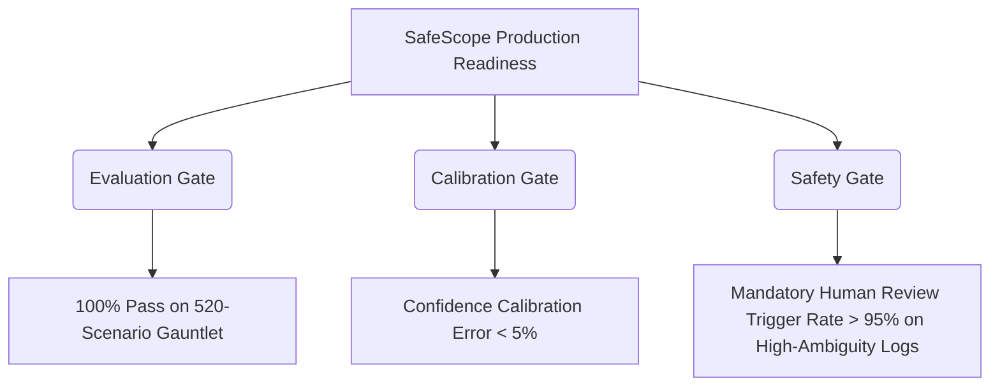

# SafeScope Production Readiness Plan

This document defines the roadmap, evaluation criteria, and calibration requirements for deploying the **SafeScope Safety Intelligence Engine** to production. It establishes rigorous gates to guarantee reliability, regulatory accuracy, and safety-critical alignment.

---

## 1. Executive Summary & Verified Status

### Current Status
- **Verification Metric**: 100% pass rate achieved on the baseline 100-scenario SafeScope gauntlet.
- **Accuracy Check**: All 11 hazard taxonomy golden tests and 5 standards matching tests are passing without regressions.
- **Critical Fixed Traps**:
  1. Gated false-positive electrical classifications on confined space entries ( LOTO vs. installation hazards ).
  2. Blocked false-positive machine guarding classifications on warehouse exit routes.
  3. Eliminated candidate promotion sorting bugs by introducing a confidence differential threshold (`>= 0.20`), preserving the correct primary classification over higher-severity but lower-confidence candidates.

---

## 2. The 100-Scenario Pass: Strengths and Limitations

While the baseline 100-scenario pass proves that the engine's core categorization logic is mathematically sound, it is **insufficient for production deployment**.

### What it DOES Prove:
- **Taxonomy Validity**: Confirming that standard MSHA/OSHA terms ( e.g., "unguarded tail pulley" ) align with their primary regulatory families.
- **Sorting Correctness**: Validating that clear-cut hazards sort correctly based on risk and priority.
- **Regenerative Quality**: Ensuring corrective actions are generated in accordance with safety best practices.

### What it DOES NOT Prove:
- **Versatility & Noise Immunity**: Small evaluation sets cannot guarantee that the model is immune to real-world field report noise, spelling variations, or shorthand jargon.
- **Boundary Precision**: 100 scenarios cannot exhaustively test lookalike keyword boundaries ( e.g., the word "wire" in a rigging line vs. high-voltage wires ).
- **Calibration Safety**: It does not prove that the model's confidence scores correspond to true accuracy, risking overconfident wrong answers in live production.

---

## 3. Why Gauntlet Diversity Matters

Safety intelligence is a **zero-tolerance domain**. A classification failure can lead to:
- Field teams ignoring critical life-safety hazards.
- Supervisors performing incorrect mitigations based on misidentified regulations.
- Corporate non-compliance penalties during MSHA/OSHA inspections.

By expanding to a **520-scenario gauntlet (v2)**, we test the model's resilience against **evaluation dilution** and ensure it can adapt to diverse industrial contexts ( MSHA surface/underground, OSHA construction/general industry ) without memorizing simple observation patterns.

---

## 4. Proposed Production Readiness Criteria

SafeScope must meet these three key criteria before receiving deployment approval:

1. **Evaluation Gate**: The engine must achieve a **>= 98% pass rate** on the expanded 520-scenario v2 gauntlet, with an average decision score **> 90**.
2. **Calibration Gate**: The Expected Calibration Error ( ECE ) must be **< 5%**, ensuring that a confidence score of 90% corresponds to at least a 90% empirical probability of being correct.
3. **Safety Gate**: All highly ambiguous, low-detail, or mixed-hazard entries must successfully trigger a `"Review Required"` classification or alert supervisors for manual verification.

---

## 5. Required Evaluation Categories and Pass Thresholds

Before deployment, SafeScope must undergo a formal **Multi-Dimensional Verification (MDV)** run. The verification categories, counts, and strict pass gates are defined below:

| Test Category | Target Count | Minimum Pass Gate | Expected Outcome |
| :--- | :---: | :---: | :--- |
| **Clear-Cut Golden Tests** | 100 | **100%** | Precise matching of standard OSHA/MSHA terms with no boundary overlap. |
| **Hard-Negative Decision Traps** | 150 | **98%** | Decouples lookalike keywords ( e.g., "wire rope" vs. "electrical wire" ) successfully. |
| **Mixed-Hazard Syntheses** | 100 | **95%** | Correctly identifies primary hazard family and appends secondary risks. |
| **Low-Detail Field Logs** | 100 | **98%** | Correctly triggers `Review Required` or demotes confidence scores below 0.50. |
| **Cross-Agency Mining (MSHA)** | 70 | **100%** | Explicit matching of MSHA 30 CFR standards for surface and underground mines. |

---

## 6. Confidence Calibration & Human Review Rules

To prevent overconfidence, SafeScope must enforce automated **Human Review Triggers**:

### Rule 1: High Ambiguity Boundary
If the classification margin ( best candidate score minus second best ) is **<= 3**, the system must append an `ambiguityWarning` and force a `requiresHumanReview: true` state, regardless of the best score.

### Rule 2: Low Detail Demotion
Any observation with less than 6 tokens ( e.g., "damaged cables" ) is restricted to a maximum confidence of **0.50 (low)** and must be flagged for manual review.

### Rule 3: Key Safety Exclusions
Any finding containing critical exclusion terms ( e.g., "chemical" but no "entry" indicators in confined spaces ) must be actively demoted to prevent false-positive standard suggestions.

---

## 7. Standards Citation Accuracy Expectations

- **Primary Citation Match**: The primary citation suggested by the engine must be legally defensible. For instance, an unguarded pulley in a mining context *must* cite `30 CFR 56.14107(a)`. Citing generic housekeeping or unrelated electrical standards is a **critical failure**.
- **Secondary Citation Limit**: Secondary supporting citations are limited to 3 per finding to prevent information clutter on field action sheets.

---

## 8. Recommended Public Data Sources for Grounded Scenarios

To ensure the gauntlet matches real-world failures, future scenario expansions ( v3 ) should be seeded using:
1. **MSHA Fatal Grams & Accident Reports**: High-value, real-world accident narratives involving mobile equipment, belt conveyors, and roof falls.
2. **OSHA Severe Injury Reports Database**: Public records detailing industrial amputations, fall injuries, and electrical accidents.
3. **NIOSH Mine Safety Technology Publications**: Industry-wide research reports outlining ground control and dust containment data.

---

## 9. Next Engineering Remediation Steps

If executing the v2 gauntlet exposes failures, engineers must prioritize these fixes:
1. **Metadata Stripping in Classifier**: Clean out headers like `"Equipment context: "` or `"Agency: "` before performing taxonomy keyword matching inside the classifier to prevent false-positive triggers.
2. **Context-Aware Semantic Embeddings**: Transition the classifier from weighted keyword matching to a local vector similarity model ( using safe sentence-transformers ) to capture semantic intent, not just keyword occurrence.
3. **Regulatory Crosswalk Seed Expansion**: Add specific cross-agency mappings in `standards-mapping.seed.ts` to bridge minor industry context gaps.
