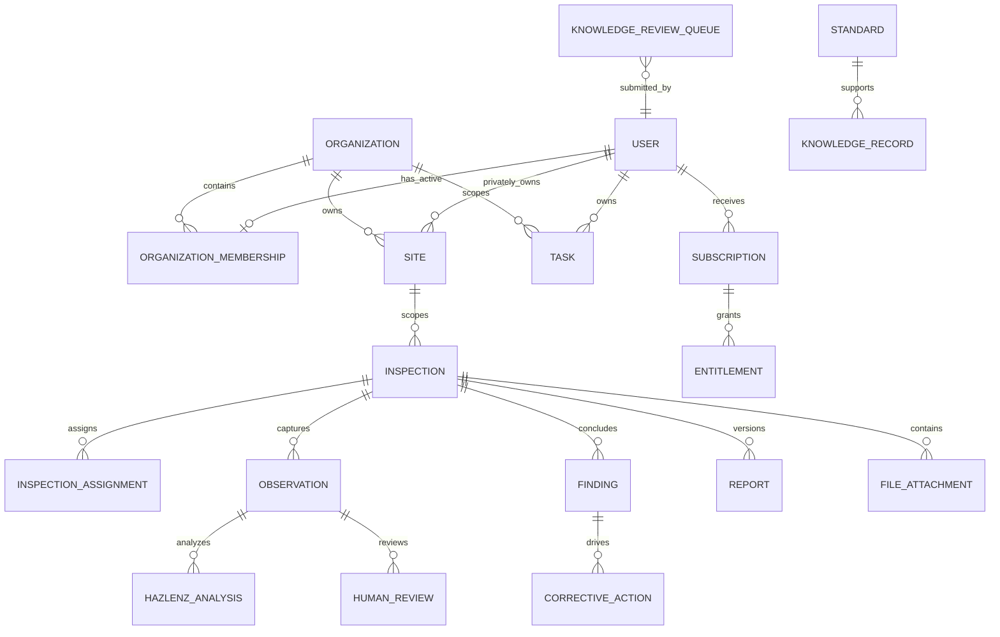

# Canonical entity model

## Decision

Use UUID primary keys, PostgreSQL constraints, explicit TypeORM entities/migrations, UTC `timestamptz` audit fields, and parent-inherited scope. `synchronize` remains disabled.

## Entity specification

| Entity | Scope/parent | Lifecycle and mutability | Authority and transfer |
|---|---|---|---|
| User | self | active/disabled/deleted; audited | self/profile; platform disable; no transfer |
| Organization | global tenant | active/archived | org admin; no hard delete in pilot |
| Membership | user + organization | invited/active/suspended/ended | manager invite; admin role/end |
| Site | XOR user/org | active/archived | owner or manager/admin; controlled transfer |
| Inspection | site | draft/in_review/completed/archived; version counter | creator/assignment then manager; no cross-scope transfer after completion |
| Assignment | inspection + user | active/ended; role collaborator/reviewer | creator while draft, manager/admin |
| Observation | inspection | append/edit in draft; versioned after review | authorized draft editor |
| Finding | inspection + observation | captured/analyzed/needs_review/finalized/dismissed | reviewer/finalizer; revisions create version/audit |
| HazLenzAnalysis | observation | immutable snapshot; superseded only by new snapshot | system creates; nobody updates |
| HumanReview | observation/finding/analysis | immutable decision event | authorized reviewer |
| Report | inspection | pending/generated/failed/archived; immutable generated version | entitled authorized user |
| CorrectiveAction | finding, optionally inspection-only | open/in_progress/completed/cancelled | creator/assignee/manager |
| Task | user or org XOR; optional site/inspection | open/completed/cancelled | owner/assignee/manager |
| FileAttachment | parent polymorphic through explicit type+validated ID | active/quarantined/deleted | parent-authorized upload/delete |
| Subscription | user for initial release | provider state | billing service/admin |
| Entitlement | subscription or explicit pilot grant | active/expired/revoked | billing service/platform admin |
| Standard | global | versioned/published/retired | ingestion/platform admin |
| KnowledgeRecord | global | draft/reviewed/published/retired | ingestion/platform admin |
| KnowledgeReviewQueue | submitter + global target | submitted/triaged/accepted/rejected | users submit; platform admin adjudicates |

All mutable business entities require `createdAt`, `updatedAt`, `createdByUserId`; archive-capable records add `archivedAt`, `archivedByUserId`. Security/audit events are append-only. Child records cannot exist without parents except global records and user subscriptions.

## Observation versus finding

They are separate. Observation preserves raw text, photos, source, timestamp, and edits. Finding stores the human-approved hazard conclusion. One observation may produce zero or more findings; each finding identifies the selected analysis and final review.

## Retention and deletion

Pilot records are archived, not hard-deleted. Files follow the parent. Final legal retention duration is external; until decided, no automated purge runs. User privacy deletion requests require export and operator review.

## Alternatives, impacts, tests, risks

Reusing report findings as observations was rejected because it loses raw evidence and review provenance. Polymorphic attachments require strict application validation; separate attachment tables are safer relationally but duplicate storage logic. Implementation must test XOR constraints, FKs, version immutability, archive filtering, parent deletion, and authorization. Multi-org and tenant knowledge remain deferred.
