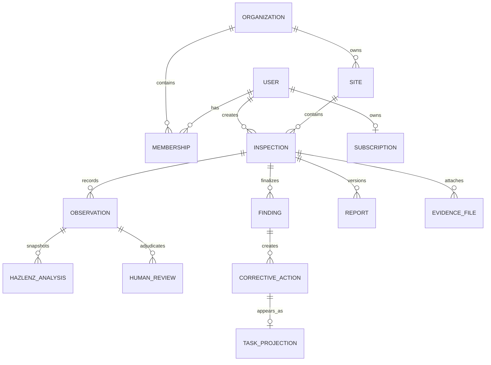

# Canonical domain model decision

## Decision status: blocked

The repository does not establish one defensible canonical domain model. Phase 3 did not invent one.

The minimum model requiring product approval is:

Unresolved decisions that prevent implementation:

1. A user currently has one `organizationId`; multi-organization membership and A1/A2 roles do not exist.
2. Sites appear organization-owned, but individual users are a documented product type and no individual-site rule exists.
3. Inspections contain organization and creator fields but no site relationship or lifecycle.
4. Three materially different finding models exist.
5. Reports are both local documents and cloud records; the migration and entity disagree on required columns and meaning.
6. Calendar items are local first-class records, while corrective actions are backend records; no projection contract exists.
7. Knowledge/review data mixes global regulatory material and workspace identifiers without an admin/tenant policy.

Required product decisions: organization collaboration rights, individual-user behavior, report immutability/versioning, calendar projection semantics, and global versus tenant knowledge governance.
